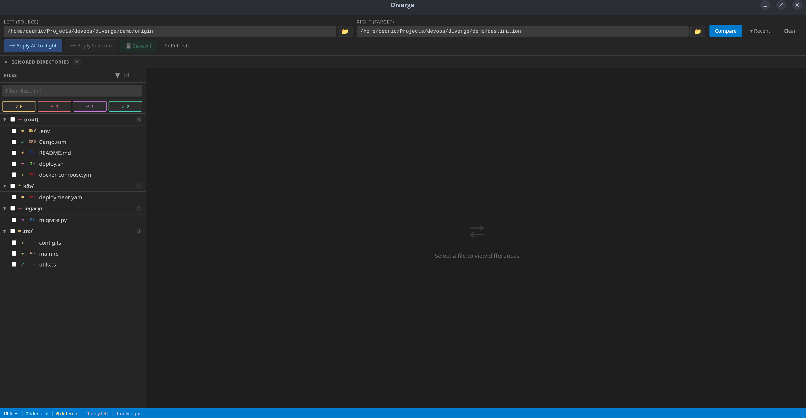
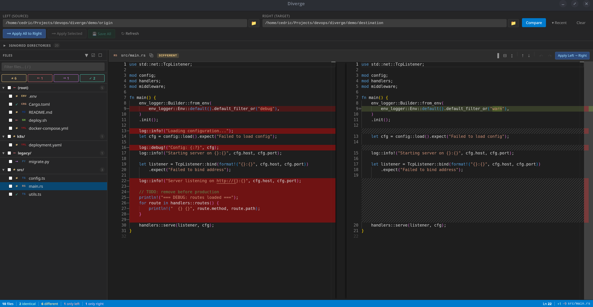

# Diverge

A desktop app for comparing two directories side-by-side with inline editing. Built with Tauri, React, TypeScript, and Monaco Editor.


## Features

- Monaco-powered side-by-side diffs with collapsible unchanged regions
- Apply changes left-to-right per-file or in bulk, with inline editing before saving
- Folder tree with search, checkboxes, and color-coded file statuses
- Keyboard navigation
- Document outline for YAML/JSON/code files
- Configurable ignore directories (`~/.diverge/config.yaml`)
- CLI and GUI support — Linux (X11/Wayland) and macOS





## Install

### From releases

Download the latest release from the [Releases](https://github.com/Cedric-Lefebvre/diverge/releases) page.

**Linux:** Download the `.deb` or `.AppImage` file.

```bash
# .deb (Debian/Ubuntu)
sudo dpkg -i Diverge_x.x.x_amd64.deb

# .AppImage (any distro)
chmod +x Diverge_x.x.x_amd64.AppImage
./Diverge_x.x.x_amd64.AppImage
```

**macOS:** Download the `.dmg` file. See the [macOS install guide](#macos-install) below.

### From source

Prerequisites: [Node.js](https://nodejs.org/), [pnpm](https://pnpm.io/), [Rust](https://rustup.rs/), and the [Tauri v2 prerequisites](https://v2.tauri.app/start/prerequisites/) for your OS.

```bash
git clone https://github.com/Cedric-Lefebvre/diverge.git
cd diverge
pnpm install
pnpm tauri build
```

The built packages (`.deb`, `.rpm`, `.AppImage` on Linux, `.dmg` on macOS) will be in `src-tauri/target/release/bundle/`.

## macOS install

### Installing the .dmg

1. Open the `.dmg` file
2. Drag **Diverge** to the **Applications** folder
3. On first launch, macOS may block the app because it is unsigned. Right-click (or Ctrl+click) the app in Applications and select **Open**, then click **Open** in the dialog

If you see "Diverge is damaged and can't be opened", run:

```bash
xattr -cr /Applications/Diverge.app
```

### Adding to PATH (CLI usage)

To use `diverge` from the terminal, create a symlink:

```bash
sudo ln -sf /Applications/Diverge.app/Contents/MacOS/Diverge /usr/local/bin/diverge
```

Now you can run:

```bash
diverge ./folder-a ./folder-b
```

## Usage

### GUI

Launch the app and use the folder pickers to select two directories, then click **Compare**.

### CLI

```bash
# Absolute paths
diverge /path/to/left /path/to/right

# Relative paths (resolved from current directory)
diverge ./env-staging ./env-production

# Mix both
diverge ./local-config /etc/app/config
```

### Keyboard shortcuts

| Key | Action |
|-----|--------|
| `↑` / `k` | Previous file |
| `↓` / `j` | Next file |
| `Space` | Toggle checkbox |
| `/` | Focus search bar |
| `Escape` | Blur search / close modal |

### Configuration

Settings are stored in `~/.diverge/config.yaml`. You can edit them from the app (collapsible "Ignored Directories" panel) or directly in the file.

```yaml
ignore_dirs:
  - .git
  - node_modules
  - __pycache__
  - target
  - vendor
editor_preferences:
  minimap_enabled: false
```

### Development

```bash
pnpm tauri dev

# With folders pre-loaded
pnpm tauri dev -- -- ./left-folder ./right-folder
```

### Running tests

```bash
# Rust tests
cd src-tauri && cargo test

# Frontend tests
pnpm vitest run
```

## Project structure

```
src/                    # React frontend
  components/           # FileTree, DiffEditor, Toolbar, StatusBar, OutlineModal, SettingsPanel
  hooks/                # useCompare, useDirectories, useFileTree, useModifications, useSettings, useToast
  utils/                # Path utilities, language detection, structure parser
  constants/            # Status styles, Monaco config
  types.ts              # Shared TypeScript interfaces
src-tauri/              # Rust backend
  src/
    main.rs             # CLI arg parsing, entry point
    lib.rs              # Tauri app setup
    commands.rs         # Tauri IPC commands
    compare.rs          # Directory comparison logic
    scanner.rs          # Recursive file scanning
    config.rs           # YAML config management
    models.rs           # Data structures
```

## License

MIT
